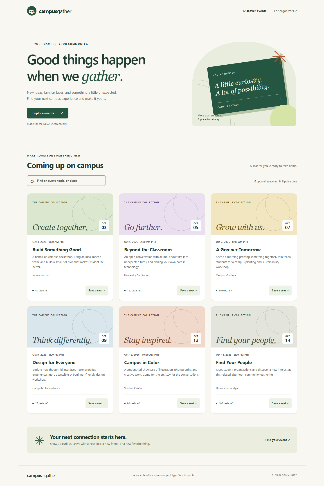

# Campus Gather — Online Campus Event Management System

S-ITPE006LA-Resos-Raquin-Sabino-MidtermSummative

A working laboratory prototype for John Alec Resos, Renz Mathieu Raquin, and Matthew Ryan Sabino. Students browse events and register with an `@dlsud.edu.ph` email; organizers view attendees. All events and verification student records are fictional.



## Run locally on Windows

Prerequisites: .NET 10 SDK and SQL Server LocalDB. A project-local .NET SDK is already available on the machine where this was built, in ignored `.tools/dotnet`; teammates must install their own SDK. Node.js is needed only for optional browser checks and documentation regeneration.

From this repository:

```powershell
powershell -NoProfile -ExecutionPolicy Bypass -File scripts/Run-Local.ps1
```

Open **http://127.0.0.1:5080**. The script initializes the dedicated `CampusEventsMidterm` database, applies `database/schema.sql`, adds six sample events only if the catalog is empty, and starts the application. It prints a temporary organizer key when `CAMPUS_ADMIN_KEY` has not been set. Enter that key at **http://127.0.0.1:5080/admin.html**. Keep the terminal running; Ctrl+C stops the server. Saved registrations persist across restarts.

The PowerShell execution-policy argument applies only to this script process; it does not change your machine's policy. The application binds to loopback. Use a free port 5080 and run only one instance at a time.

### Manual commands

```powershell
dotnet restore tests/CampusEvents.Tests/CampusEvents.Tests.csproj
dotnet run --project backend/CampusEvents.csproj -- --init-db
$env:CAMPUS_ADMIN_KEY = 'choose-your-own-local-demo-key'
dotnet run --project backend/CampusEvents.csproj
```

If using the project-local SDK, replace `dotnet` with `.\.tools\dotnet\dotnet.exe`. The default LocalDB connection uses Windows integrated security; no SQL password is stored. To use another SQL Server, set `ConnectionStrings__CampusEvents` in the current terminal to your connection string before running either initialization or the server. `TrustServerCertificate=true` is for this local setup; configure certificate validation for a deployment.

The frontend is served by the backend. Do not open `frontend/index.html` as a file or run an unrelated static server. Database initialization uses the SQL files directly; you may alternatively create/select a dedicated database in SQL Server Management Studio and execute `database/schema.sql`, then `database/seed.sql`.

## Verification

```powershell
dotnet test tests/CampusEvents.Tests/CampusEvents.Tests.csproj
```

Optional end-to-end verification, including a dedicated database, browser checks, and saved evidence:

```powershell
npm.cmd ci --ignore-scripts
powershell -NoProfile -ExecutionPolicy Bypass -File scripts/Verify.ps1
```

`Verify.ps1` requires port 5080 to be free and uses new `CampusEventsVerification_*` databases. It retains them for inspection and never drops a database. Chrome is used from its standard Windows path; set `CHROME_PATH` if yours differs. No real student information is needed. See [verification evidence](docs/evidence/README.md).

## Examination deliverables

| Task | Files |
|---|---|
| 1: RCTC design and grounding | [Exact prompt and architecture](SUBMISSION.md#task-1---requirements-analysis--prompt-architecture), [original AI design](docs/task-1-ai-output.md) |
| 2: Semantic, accessible UI | [frontend/](frontend/), [accessibility mapping](docs/frontend-notes.md) |
| 3: 3NF schema and ERD | [schema.sql](database/schema.sql), [erd.mmd](database/erd.mmd), [design notes](database/DESIGN.md) |
| 4: Mocked tests and C# security refactor | [tests](tests/CampusEvents.Tests/EmailValidatorTests.cs), [RegistrationService.cs](backend/RegistrationService.cs), [security review](docs/security-review.md) |
| 5: Consolidated report and disclosure | [SUBMISSION.md](SUBMISSION.md) |
| All prompts and output evidence | [PROMPTS.md](docs/PROMPTS.md), [AI_OUTPUTS.md](docs/AI_OUTPUTS.md) |

The report explicitly separates completed automated verification from human review still required by the exam. Team members must confirm role assignments, review the implementation, and record their own actual manual corrections and sign-offs. Do not claim the AI's changes were made manually by a student.

## Troubleshooting

- `dotnet` not found: install the .NET 10 SDK, or use the project-local SDK command above.
- Database unavailable: verify LocalDB is installed and `SqlLocalDB info MSSQLLocalDB` succeeds, then rerun initialization. Automated agent sandboxes may require elevated tool permission to access the current user's LocalDB instance.
- Organizer access unavailable: set `CAMPUS_ADMIN_KEY` before starting, or use `Run-Local.ps1` to generate a temporary one.
- No upcoming events after weeks: seed dates are intentionally not rewritten on restart. Use a new dedicated demo database for a fresh catalog, preserving your existing records.
- Packages cannot be restored: allow access to NuGet; npm registry access is needed only for optional browser verification. No npm packages are required to run the app.

Architecture choice: .NET 10 is an LTS release ([Microsoft support policy](https://dotnet.microsoft.com/en-us/platform/support/policy)). The app uses a single [ASP.NET Core Minimal API](https://learn.microsoft.com/en-us/aspnet/core/fundamentals/minimal-apis?view=aspnetcore-10.0) host and explicit SQL to keep the examination scope small.
