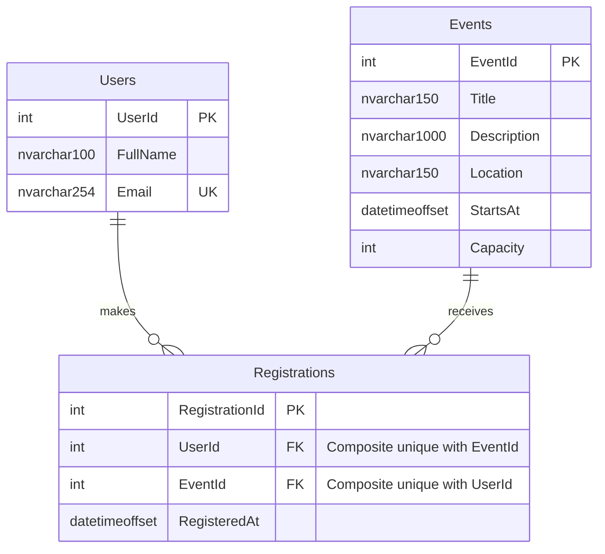

# Online Campus Event Management System

**Project:** Campus Gather · **Course:** Applied Generative AI for IT Solution Development · **Repository:** ITPE-LAB-MIDTERM

## Team Roster

The user confirmed these full names. Role allocation below is a proposed three-person split following the examination pack; actual human contributions and role acceptance still need team confirmation.

| Member | Proposed Role | Assigned Tasks |
|---|---|---|
| John Alec Resos | Systems Architect & Prompt Lead | Tasks 1 and 5, integration; share Task 4 |
| Renz Mathieu Raquin | Frontend Engineer | Task 2 |
| Matthew Ryan Sabino | Database & Backend Engineer | Task 3; share Task 4 |

## Project Overview

Campus Gather is a functioning local prototype. Students browse upcoming campus events and register using an `@dlsud.edu.ph` address. Organizers use a local administrator access key to view registered attendees for a selected event. The interface calls a C# API backed by SQL Server LocalDB; registration is persisted, duplicate sign-ups are blocked, and a locked transaction prevents overbooking through the service.

The three-member team, exact university domain, and names came from the user. Sample event names are fictional, not official DLSU-D announcements. The selected scope excludes full authentication, event editing, payments, notifications, and analytics. Domain validation is not proof of mailbox ownership or enrollment.

## Setup Instructions

1. Install the .NET 10 SDK and SQL Server LocalDB on Windows. Node.js and Chrome are optional prerequisites for browser checks. This workspace has a project-local SDK at `.tools/dotnet/dotnet.exe`, ignored by Git; it is not bundled for teammates.
2. From the repository root run `powershell -NoProfile -ExecutionPolicy Bypass -File scripts/Run-Local.ps1`. It restores/builds the C# project, initializes a dedicated database, and starts the server. NuGet access is needed for the first restore.
3. `backend/appsettings.json` uses Windows integrated security for `(localdb)\MSSQLLocalDB`, database `CampusEventsMidterm`. Override it with environment variable `ConnectionStrings__CampusEvents` if needed. The configured university domain is `dlsud.edu.ph`.
4. Open `http://127.0.0.1:5080` for the frontend. The backend serves the frontend and API from the same origin; no separate UI server is required.
5. Open `/admin.html`, and enter the temporary administrator key printed by `Run-Local.ps1`. Alternatively set `CAMPUS_ADMIN_KEY` before starting. Never commit a real key. The browser retains it only in page memory.
6. `dotnet run --project backend/CampusEvents.csproj -- --init-db` creates the configured database, runs the exact `database/schema.sql`, then `database/seed.sql`. Re-running preserves existing data. Alternatively create/select a dedicated database in SSMS and run those two scripts in that order. Dates are seeded relative to initialization, with +08:00 offsets.
7. Run `dotnet test tests/CampusEvents.Tests/CampusEvents.Tests.csproj`. For complete verification with port 5080 free, run `npm.cmd ci --ignore-scripts` and `powershell -NoProfile -ExecutionPolicy Bypass -File scripts/Verify.ps1`. Replace `dotnet` with `.\.tools\dotnet\dotnet.exe` when using the local SDK.
8. Source is in `frontend/`, `backend/`, `database/`, and `tests/`. Every adopted prompt is in [docs/PROMPTS.md](docs/PROMPTS.md), and generated-output evidence is in [docs/AI_OUTPUTS.md](docs/AI_OUTPUTS.md).

## Task 1 - Requirements Analysis & Prompt Architecture

### Exact Prompt Used

This is the RCTC prompt supplied in the user's prompt pack and adopted as the Task 1 specification in this Codex session. It was read from the file, not separately pasted by a team member into another AI chat. The actual user requests and implementation context are recorded in `docs/PROMPTS.md`.

```text
ROLE
You are a Lead Systems Architect specializing in lightweight web application prototypes, requirements analysis, and practical architecture design.

CONTEXT
We are building a working prototype for an Online Campus Event Management System as a 3-man team laboratory examination for 4th-year BSIT students.

The system must allow:
1. Students to view upcoming campus events.
2. Students to register for an event.
3. Administrators to view registered attendees.

The project will be developed collaboratively by a 3-man team. The architecture must therefore be simple enough to implement, test, and integrate within the available time.

TASK
Create an overall system design for the Online Campus Event Management System.

Your response must include:
1. A concise requirements summary.
2. Functional requirements.
3. Non-functional requirements relevant to the prototype.
4. Recommended frontend, backend, database, and testing approach.
5. High-level system architecture and data flow.
6. Core modules/components and their responsibilities.
7. Main entities and relationships.
8. A practical API or service boundary proposal, if applicable.
9. A simple implementation plan ordered by priority.
10. Risks, assumptions, and time-saving decisions for a prototype.
11. A suggested repository structure that separates frontend, backend, database, tests, and documentation.

CONSTRAINTS
- Keep the architecture realistic for a 3-man team prototype.
- Prefer simple, maintainable solutions over enterprise-level complexity.
- Do not invent requirements that are not needed to satisfy the stated problem.
- Do not add microservices, event-driven infrastructure, Kubernetes, or other heavy infrastructure unless there is a direct requirement for them.
- Do not use third-party state management libraries such as Redux unless there is a clear project requirement for them.
- Do not introduce unnecessary authentication, payment, analytics, chat, or notification systems unless explicitly identified as assumptions for a future phase.
- Clearly label assumptions.
- Explain why each recommended technology or architectural decision is appropriate for the time limit.
- Keep the proposed solution implementable by beginner developers.

OUTPUT FORMAT
Use clear headings and concise tables where useful.
End with a short section titled "Prototype Feasibility" explaining what should be implemented first and what should be deferred.
```

### AI Output

The following reproduces `docs/task-1-ai-output.md` verbatim, including its headings. It is the architecture output authored in this session before the implementation.

# Overall System Design

## 1. Requirements Summary

Build a local, working Online Campus Event Management System that lets students view upcoming events and register, and lets an administrator view each event's attendees. Keep the prototype small enough for a three-person team to understand and demonstrate.

## 2. Functional Requirements

| ID | Requirement | Implementation boundary |
|---|---|---|
| FR1 | List upcoming events with title, description, location, date/time, and available seats | Event catalog and GET /api/events |
| FR2 | Register a named student with a valid university email | Registration form and POST /api/registrations |
| FR3 | Display registered attendees for a selected event | Administrator page and protected GET /api/admin/events/{id}/attendees |
| FR4 | Reject duplicate registrations, invalid inputs, started events, and full events | Server validation, database uniqueness, and transaction |

## 3. Non-functional Requirements

Use semantic HTML, labeled controls, visible keyboard focus, readable contrast, and textual validation feedback. Persist records in a relational database. Parameterize database input and dispose connections and commands. Keep error responses understandable without exposing database details. Separate the UI, service, SQL, tests, and documentation so team members can work independently.

## 4. Technology Recommendations

| Layer | Choice | Reason |
|---|---|---|
| Frontend | Plain HTML5, CSS, JavaScript modules | No bundler or UI framework setup; sufficient for two small pages |
| Backend | .NET 10 ASP.NET Core Minimal API | Matches the examination's C# deliverable and provides a small HTTP boundary |
| Database | SQL Server LocalDB with explicit SQL | Matches SqlConnection and explicit non-clustered indexes in the prompt pack |
| Unit tests | xUnit and Moq | Familiar Arrange-Act-Assert tests with a mocked domain-policy dependency |
| Integration checks | PowerShell/HTTP and browser automation | Exercise the actual database, API, and student/admin flow separately from unit tests |

Serve the frontend from the backend's origin to avoid a second server and CORS configuration. Use Microsoft.Data.SqlClient directly; an ORM is unnecessary for three tables.

## 5. Architecture and Data Flow

```text
Student / administrator browser
            |
    HTML + CSS + JavaScript
            | same-origin JSON requests
    ASP.NET Core Minimal API
            |
    Validation + RegistrationService
            | parameterized commands / registration transaction
    SQL Server LocalDB
       Users -- Registrations -- Events
```

The catalog queries future events and calculates availability from capacity minus registration count. A registration request validates the student's name and exact university email domain, locks the event within a transaction, checks capacity and duplicates, finds or creates the user, and inserts the registration. Only after commit does the UI report success. An administrator supplies a locally configured demo access key before attendee data is returned.

## 6. Components

The event catalog renders cards and handles loading, empty, and retry states. The registration form displays the selected event, validates input, submits to the API, and refreshes seats. The administrator page chooses an event and renders a labeled attendee table. EmailValidator depends on an IUniversityDomainPolicy so unit tests can replace configuration with a mock. RegistrationService owns the SQL queries and transaction. DatabaseBootstrap applies schema and optional demo seed data to a dedicated database.

## 7. Entities and Relationships

Users stores UserId, FullName, and a unique normalized Email. Events stores EventId, Title, Description, Location, StartsAt, and Capacity. Registrations stores RegistrationId, UserId, EventId, and RegisteredAt. Each user and event can have many registrations; a unique UserId/EventId pair prevents duplicates. Do not repeat an email in Registrations or persist derived available-seat counts. This produces three tables in Third Normal Form.

## 8. API Boundaries

| Method | Path | Result |
|---|---|---|
| GET | /api/config | Public university email-domain configuration |
| GET | /api/events | Upcoming event catalog and derived available seats |
| POST | /api/registrations | 201 confirmation; 400 invalid input; 404 missing event; 409 duplicate/full/started |
| GET | /api/admin/events | Event choices, including past events; requires admin key |
| GET | /api/admin/events/{id}/attendees | Attendee list; requires admin key |

Use clear JSON error messages and explicit status codes. The admin key is a small local-demo access guard, not a full account or login system.

## 9. Prioritized Implementation Plan

First agree on schema, DTO field names, university domain, and endpoint paths. Then create SQL and the C# service, followed by the catalog/form and administrator view. Add isolated validation tests and integration checks for duplicates and capacity. Finally execute the schema, build and test, review accessibility, and consolidate evidence and prompts in SUBMISSION.md.

## 10. Assumptions, Risks, and Time-saving Decisions

Assumptions: this is a local classroom prototype; SQL Server LocalDB is available on Windows; registration accepts the exact dlsud.edu.ph domain supplied by the user; three team members share QA; events are seeded sample activities rather than official university announcements. Store event timestamps as datetimeoffset and display them in Asia/Manila. Dates in seed data are relative to initialization so the first demonstration has upcoming events.

Email-domain validation does not prove identity or email ownership. The administrator key must stay out of source control and browser persistence. This prototype is not ready for public deployment without actual authentication and authorization. Concurrency is a real correctness risk: capacity checks and insertion must occur in one transaction with an event lock. Do not silently rename an existing user when the same email is submitted again. Full event administration, payments, notifications, analytics, SSO, and distributed infrastructure are deferred.

## 11. Repository Structure

```text
frontend/          Semantic catalog, registration form, admin page, CSS and JS
backend/           API, validation, RegistrationService.cs, database bootstrap
database/          schema.sql, seed.sql, erd.mmd, design notes
tests/             xUnit mock tests and integration/browser checks
scripts/           Local setup, run, verification, evidence assembly
docs/              Exact adopted prompts, AI outputs, security review, evidence
SUBMISSION.md      Consolidated examination report
README.md          Quick start and deliverable map
```

## Prototype Feasibility

Implement the schema, catalog, transaction-safe registration, and attendee view first because they demonstrate all three required capabilities. Share fixed API contracts between frontend and backend work, and reserve the final portion of the time for integration and documentation. Defer every feature outside those three capabilities; complete mocked tests, the security refactor, and honest verification evidence before submission.

### Manual Grounding Evaluation

**AI-drafted evaluation for human review; not a claim of completed student review:** The architecture directly supports event discovery, persistent registration, and organizer attendee viewing within one small application. Plain HTML/CSS/JavaScript and explicit SQL keep the components understandable, although restoring the SDK and setting up LocalDB can consume examination time. The database and C# requirements fit the selected stack, and the transaction addresses capacity without adding unrelated infrastructure. The team should confirm the setup, API integration, accessibility, and stated assumptions before adopting this evaluation as its own manual assessment.

## Task 2 - AI-Assisted Frontend Development

### AI Tool Used

OpenAI Codex in this workspace session. The exact serving model/build identifier is not independently verified; no version is invented. The local UI/UX Pro Max skill guided design and accessibility checks.

### Prompt Summary

Adopted the pack's frontend prompt to build semantic event cards and a registration form with labels, validation, focus, contrast, and success feedback. The project-specific context supplied the C# API, the exact university domain, and a simple organizer attendee page. The exact frontend prompt is preserved in `docs/PROMPTS.md`.

### Implementation Evidence

`frontend/index.html`, `styles.css`, `app.js`, and `api.js` implement the catalog and native registration dialog. `frontend/admin.html` and `admin.js` implement the attendee table and local organizer-key flow. The browser reads actual seeded database events; it does not fake registration success. Desktop, mobile, form, success, and administrator screenshots are in [docs/evidence](docs/evidence/).

### Accessibility Verification

| Requirement | Implementation / verification evidence |
|---|---|
| Semantic HTML5 | header, nav, main, section, article, footer, form, dialog, table, caption, time; axe landmark checks |
| Proper labels | Explicit full-name, email, administrator-key, event-select labels; search input has accessible name |
| aria-label / accessible naming | Named navigation, search, event-specific register buttons, close button, titled dialog; aria-describedby and aria-invalid |
| Color contrast | Semantic dark-green/cream palette; axe contrast scan in five UI states; complete manual contrast review remains for the team |
| Image alt text | No informative images; CSS/text decoration is aria-hidden; event details remain visible as ordinary text |
| Keyboard/focus accessibility | Skip link; visible focus outline; keyboard-opened native dialog; focus moves to the form; Escape closes it; focus restores after closing |
| Status not communicated by color alone | Text errors and confirmation, loading/empty states, role=status/alert; full events have text and disabled buttons |

Automated accessibility results are evidence, not a claim of full WCAG compliance. A human keyboard and screen-reader review remains required. The detailed POUR mapping is [docs/frontend-notes.md](docs/frontend-notes.md).

## Task 3 - Database Design & ERD Generation

### AI Tool Used

OpenAI Codex & Gemini.

### Prompt Summary

Adopted the database prompt requiring Users, Events, Registrations, 3NF, explicit keys and referential actions, useful CHECK/UNIQUE constraints, Mermaid ERD, and non-clustered foreign-key indexes. SQL Server was selected to match the examination's C# snippet and indexing language.

### Mermaid ERD



### Database Script

The final SQL DDL is [database/schema.sql](database/schema.sql). Entity definitions and types, assumptions, normalization analysis, and index rationale are in [database/DESIGN.md](database/DESIGN.md). Fictional data is in `database/seed.sql`.

### Database Verification

The schema executed successfully in SQL Server LocalDB. Integration checks verified positive capacity, foreign-key rejection, composite registration uniqueness, restrictive parent deletion, and a leading non-clustered index for each FK. The composite `(UserId, EventId)` unique index covers UserId; a separate non-clustered EventId index covers event-attendee and capacity queries. The schema keeps user names/emails out of Registrations and derives available seats instead of storing redundant counts. The ERD is mechanically embedded from the canonical source; human normalization and cardinality sign-off remains pending.

## Task 4 - Shift-Left Testing, Security & Refactoring

### Unit Testing

`EmailValidator` checks syntax, maximum length, local-part boundaries, and an exact case-insensitive university domain. `IUniversityDomainPolicy` is an external configuration boundary mocked with Moq. xUnit executes 27 cases covering valid university addresses, non-university addresses, null/empty input, malformed or boundary input, deceptive suffixes/subdomains, and verification of mock calls. Unit tests do not access SQL Server or network services. Arrange–Act–Assert structure and case explanations are documented in [docs/test-notes.md](docs/test-notes.md).

**Observed result:** 27 passed, zero failed, zero skipped. Raw evidence: [unit-tests.trx](docs/evidence/unit-tests.trx). Separate live checks passed all 25 database/API assertions, including eight simultaneous last-seat requests yielding one HTTP 201 and seven HTTP 409 results. Raw evidence: [integration-results.txt](docs/evidence/integration-results.txt). Browser results: [browser-results.json](docs/evidence/browser-results.json).

### Security Diagnosis

| Issue | Evidence in flawed code | Risk | Recommended fix |
|---|---|---|---|
| SQL injection | `inputEmail` concatenated into command text | Input can alter SQL syntax | Typed `@Email` parameter |
| Connection not disposed | Opened connection has no `using`/`finally` | Pool/resource exhaustion after normal or exceptional exit | Scoped `using` connection |
| Command not disposed | Command has no disposal scope | Resources are not deterministically released | Scoped `using` command |
| Null dereference | `ExecuteScalar().ToString()` | Empty query result can throw | Handle `null` and `DBNull` |
| Embedded credentials | Connection string includes username/password fields | Real substituted secrets could leak | Configuration/integrated security |
| Ambiguous scalar result | `SELECT *` without ordering | Unspecified column/row returned | Select one documented ID with deterministic ordering |

The exact flawed snippet is preserved unchanged in the Task 4B and 4C prompts. Detailed diagnosis and prioritized remediation are in [docs/security-review.md](docs/security-review.md).

### Refactored Backend

The required implementation is [backend/RegistrationService.cs](backend/RegistrationService.cs), method `GetUserRegistration`. SQL is fixed and the email is a typed, sized parameter. Connection and command use `using var`, guaranteeing disposal on both success and exception. The normalized schema requires joining Users to Registrations. The method returns the latest registration ID or null when no record exists. Integration verification exercised a normal lookup, a no-row lookup, and a valid-format email containing SQL metacharacters. Input validation supports business rules; parameterization is the SQL injection defense.

## AI Disclosure Statement

| Tool / resource | Use and generated output | Actual verification status |
|---|---|---|
| OpenAI Codex | Architecture, HTML/CSS/JS UI, C# API and refactor, SQL, tests, documentation, and test corrections | The agent compiled and ran automated checks and inspected generated screenshots. Team manual review remains pending. |
| Local UI/UX Pro Max skill | Design and accessibility guidance for forms, focus, contrast, responsive layout, and feedback | Guidance was adapted to the exam scope; no added UI framework or runtime dependency |
| Microsoft documentation | Reference for .NET, Minimal APIs, SQL parameters, disposal, and locking | Technical references, not a separate generative AI tool |
| xUnit/Moq, Playwright/axe | Test execution, mock isolation, browser automation, accessibility reports | These are testing tools, not additional AI authors |

No other AI tool or image generator was used in this session. Team members must add any AI tools they independently used. The exact supplied prompts and actual user steering appear in [docs/PROMPTS.md](docs/PROMPTS.md); generated code/output snapshots appear in [docs/AI_OUTPUTS.md](docs/AI_OUTPUTS.md). Prompts are not represented as separate human-submitted conversations, and agent refinements are not represented as student-made changes.

## Group Verification Log

The examination requires at least three actual manual corrections/refinements with responsible team members. The AI cannot truthfully certify student work that has not happened. The implemented refinements below are review-ready; each team member must inspect them and record any correction they actually perform, along with their name/date. Until then, this is an agent verification record, not a completed human correction log.

| Task # | Identified AI Flaw / Limitation | Correction / Refinement Applied | Member Responsible |
|---|---|---|---|
| 1 | The project started without a selected stack; unconstrained choices could conflict with the C# and SQL Server deliverables | Selected one ASP.NET Core host, LocalDB, and framework-free frontend; deferred unrelated features | Agent implementation; proposed reviewer John Alec Resos |
| 2 | A search placeholder does not provide an explicit stable accessible name | Added `aria-label="Search campus events"`; native labels, focus flow, and textual validation accompany it | Agent correction; proposed reviewer Renz Mathieu Raquin |
| 3 | Persisting available seats could drift; checking capacity outside a transaction can overbook | Derived availability from registration count; locked event, count, and insert in one serializable transaction; verified concurrent last-seat requests | Agent refinement; proposed reviewer Matthew Ryan Sabino |
| 4 | The supplied snippet concatenates SQL input, leaks resources, assumes a Registrations.Email column, and dereferences empty scalar results | Parameterized query, `using` disposal, normalized JOIN, deterministic scalar ID, null handling | Agent refactor of the examination flaw; proposed reviewers John Alec Resos / Matthew Ryan Sabino |
| 5 | Initial browser test assumed the intended event was the first admin option; a concurrency fixture changed that order | Select the event explicitly by title and use a separate browser test database | Agent test correction; proposed QA reviewers John Alec Resos / Matthew Ryan Sabino |

## Final Repository Structure

```text
/
|-- frontend/                    Student and organizer UI
|-- backend/
|   |-- RegistrationService.cs  Required parameterized C# refactor + service
|   |-- Program.cs              API and static-file host
|   |-- EmailValidator.cs       Testable validation + domain policy
|   |-- DatabaseBootstrap.cs    Schema/seed execution
|   `-- CampusEvents.csproj
|-- database/
|   |-- schema.sql              Required 3NF DDL
|   |-- seed.sql
|   |-- erd.mmd
|   `-- DESIGN.md
|-- tests/
|   |-- CampusEvents.Tests/     xUnit + Moq
|   |-- CampusEvents.Integration/
|   |-- DatabaseVerification.cs
|   `-- browser.mjs
|-- scripts/                    Run, verify, assemble evidence
|-- docs/
|   |-- PROMPTS.md              All prompt documentation
|   |-- AI_OUTPUTS.md           Generated code/output snapshot
|   |-- task-1-ai-output.md     Original architecture output
|   `-- evidence/              Test reports and screenshots
|-- README.md
|-- MIDTERM_EXAM_PROMPT_PACK.md  Original user-supplied pack, preserved
`-- SUBMISSION.md
```

## Submission Handoff

The implementation, prompt documentation, AI evidence, tests, and report are prepared. Human review and correction records must be completed by the team; they have deliberately not been invented. GitHub access must be restored before publication can be verified; details and commands are in [docs/HANDOFF.md](docs/HANDOFF.md). Re-run the documented verification when changing source files. `scripts/assemble-docs.mjs` regenerates this report and prompt/output documents from the preserved source pack, original architecture output, schema diagram, and this template.